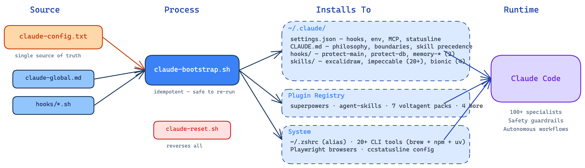

# bionic

One engineer, mass-augmented. A single bootstrap transforms Claude Code into a fully agentic engineering team — 100+ specialists, structured SDLC, safety guardrails.

```bash
git clone git@github.com:chrisalehman/bionic.git
cd bionic
./claude-bootstrap.sh
```

Re-run anytime to update. Reset with `./claude-reset.sh`.

## Patterns That Change How You Ship

Most AI tooling demos show a single agent completing a single task. That's the "hello world" of agentic development. These patterns are what happens when you treat AI agents the way you'd treat an engineering organization — with specialization, parallelism, feedback loops, and async coordination.

**Agentic Teams** — Dispatch parallel specialist teams at a problem instead of feeding everything through one context window. Audits, refactors, migrations, feature builds, incident investigations — any problem that benefits from multiple perspectives gets decomposed across concurrent agents, each bringing domain expertise, then synthesized into a coordinated result. This is the same reason no serious org assigns one engineer to do a security review, perf analysis, and accessibility audit in one sitting. Parallelism plus specialization compounds.

**Subagent SDLC Pipeline** — The superpowers plugin implements a full development lifecycle as a composable skill: brainstorm → design decisions with explicit tradeoff analysis → implementation plan → TDD → parallel execution → code review. The critical design choice: the pipeline surfaces architectural *decisions* to you rather than burying them in generated code. You make the calls that matter — technology choices, boundary definitions, consistency tradeoffs — while agents scale the implementation across a problem space you'd never tackle alone. Multi-day team efforts executed in hours, or even minutes.

**Domain Specialists on Demand** — 100+ voltagent specialists: Kubernetes debugger, PostgreSQL optimizer, security auditor, Terraform engineer, Rust systems programmer. The problems this unlocks: harden your auth layer, optimize a critical query path, untangle a Helm chart, and audit your IAM policies — simultaneously, in a single session. You don't need to be an expert in every domain. You dispatch one.

**Autonomous Debug Cycles** — A closed feedback loop: test → analyze → hypothesize → fix → build → redeploy → validate with Playwright against a running application. This is a control system, not a suggestion engine. The agent doesn't propose a fix and wait — it executes, observes, and iterates until the test passes or escalates. You come back to a resolved issue, not a diagnostic report.

**Agentic QA** — When your system under test contains agents with non-deterministic behavior, deterministic assertions break immediately. Agentic QA uses agent-based tests that observe outputs, adapt to variation, and validate *intent* rather than exact values. You test AI with AI. This is the testing problem most teams haven't hit yet — and will, the moment they ship agents to production.

**Remote Control** — Claude Code from your phone. Wherever you are on-the-go, dispatch agent teams at a debugging problem, review the design, approve a PR. The real value isn't mobile access — it's async engineering. Launch a refactoring job, get notified when the agent needs an architectural decision, approve it, move on. Every hour your credits sit idle is engineering capacity left on the table. The goal is Claude running continuously — as many parallel workstreams as you can manage. Your throughput decouples from whether you're sitting at a terminal.

## First Session

After bootstrap, try this in any project:

```
Audit this codebase — dispatch an Agent Team. Security, performance, and
architecture reviewed in parallel. Synthesize findings.
```

Watch Claude decompose the request across concurrent specialists. Each explores independently — one surfaces a vulnerability, another flags a query bottleneck, a third challenges a layering boundary. Results arrive synthesized, not sequential.

Other things to try on day one:

- `Fix this failing test. Run it. Iterate until green. Show me the result.`
- `Refactor this module — full SDLC: design decision first, then implement.`
- `Optimize this query. Measure before and after.`

## What Gets Installed

Everything lives in [`claude-config.txt`](claude-config.txt) — edit it and re-run the bootstrap. Here's what unlocks those patterns:

| Category | What |
|----------|------|
| **CLI tools** | git, node, pnpm, gh, jq, ripgrep, uv, @playwright/cli, notebooklm *(via uv)* + cloud (docker, gcloud, aws), deployment (stripe, vercel, supabase, fastlane, eas-cli), API (httpie, yq, grpcurl, protoc) |
| **Plugins** | superpowers, frontend-design, document-skills, example-skills, ui-ux-pro-max |
| **Subagents** | voltagent-core-dev, voltagent-lang, voltagent-infra, voltagent-qa-sec, voltagent-data-ai, voltagent-dev-exp, voltagent-meta |
| **MCP servers** | context7, sentry *(requires env vars)*, trello *(requires env vars)* |
| **Skills** | excalidraw-diagram, humanizer, notebooklm, impeccable (20+ design skills), bionic:rigorous-refactor, bionic:ralph-loop, bionic:map-instrument-narrow, bionic:skill-factory |
| **Hooks** | protect-main.sh, protect-database.sh |
| **Philosophy** | 10 principles for agentic development → [`~/.claude/CLAUDE.md`](claude-global.md) |
| **Shell alias** | `claude` → `claude --dangerously-skip-permissions` |

Additional tools (Kubernetes, databases, Firebase) are commented out at the bottom of `claude-config.txt` — uncomment what you need and re-run.

## How It Works

Bootstrap is idempotent — run it anytime, always get the same result. Modify [`claude-config.txt`](claude-config.txt) to add or remove tools, skills, plugins. Fork this repo for team standardization.

```
bionic/
├── claude-config.txt        # What gets installed
├── claude-global.md         # Philosophy → ~/.claude/CLAUDE.md
├── claude-bootstrap.sh      # Install (idempotent)
├── claude-reset.sh          # Remove everything
├── wsl-setup.sh             # One-time WSL2 setup (Windows)
├── test.sh                  # Run all test suites locally
├── lib/                     # Shared libraries
│   ├── platform.sh          # OS detection (macOS/Linux)
│   └── platform.test.sh     # Platform detection tests
├── hooks/                   # Safety guardrails
│   ├── protect-main.sh      # Blocks pushes to main/master
│   ├── protect-database.sh  # Blocks destructive SQL
│   └── *.test.sh            # Hook test suites
├── tests/                   # Script-level test suites
│   └── scripts.test.sh      # Config parsing, consistency, symmetry
├── skills/                  # Bionic skills → ~/.claude/skills/
│   ├── rigorous-refactor/   # Disciplined multi-file refactoring
│   ├── ralph-loop/          # Build-test-diagnose iteration cycle
│   ├── map-instrument-narrow/ # Evidence-gathering for complex debugging
│   └── skill-factory/       # Guided skill authoring with composability schema
├── ccstatusline/            # Status line config → ~/.config/ccstatusline/
│   └── settings.json        # Model, context %, cost, git branch
└── README.md
```

## Tool Reference



Everything below explains why each tool was chosen over alternatives, where it's configured, and how it fits the system. Every entry is declared in [`claude-config.txt`](claude-config.txt) — edit that file and re-run the bootstrap.

### CLI Tools

System-level dependencies that Claude Code and the bootstrap itself depend on. Most install via `brew install`; some install via `npm install -g` when they're Node.js tools — both are CLI tools Claude invokes from the shell.

| Tool | Config | Why this tool |
|------|--------|---------------|
| **git** | `brew-dep \| git` | Version control. Required by Claude Code for worktrees, diffs, and branch operations. |
| **node** | `brew-dep \| node` | JavaScript runtime. Required by npm, MCP servers (`npx`), and Playwright CLI. |
| **pnpm** | `brew-dep \| pnpm` | Fast, disk-efficient package manager. Preferred over npm/yarn for speed and strict dependency resolution. Not currently used by bootstrap itself, but available for project work. |
| **gh** | `brew-dep \| gh` | GitHub CLI. Claude uses `gh pr create`, `gh issue`, `gh api` for GitHub operations without needing browser access or tokens in env vars. |
| **jq** | `brew-dep \| jq` | JSON processor. The bootstrap script uses jq to merge hooks, env vars, and status line config into `~/.claude/settings.json` without clobbering existing settings. Also useful for Claude when parsing API responses. |
| **ripgrep** | `brew-dep \| rg \| ripgrep` | Claude Code's built-in `Grep` tool is powered by ripgrep (`rg`). Without it, code search falls back to slower alternatives. The binary is `rg` but the Homebrew package name is `ripgrep`, hence the two-field config entry. |
| **uv** | `brew-dep \| uv` | Python package manager from Astral. Used for the excalidraw-diagram skill setup (`uv sync`, `uv run`) and for installing Python CLI tools via `uv tool install` (e.g., notebooklm-py). Chosen over pip/poetry for speed — installs Python dependencies in seconds, not minutes. |
| **@playwright/cli** | `npm-global \| @playwright/cli` | Token-efficient browser automation. See below. |
| **notebooklm** | `uv-tool \| notebooklm-py \| notebooklm` | Unofficial Python CLI and agentic skill for Google NotebookLM. Provides notebook management, source handling, audio/video generation, and research capabilities. Installed via `uv tool install` into an isolated venv with the `notebooklm` binary on PATH. Requires `notebooklm login` for Google OAuth authentication. |

**Playwright CLI** — Token-efficient browser automation. Where the Playwright MCP server injects full page snapshots and screenshots into Claude's context window (~114K tokens per task), the CLI keeps browser state on disk and gives Claude compact YAML snapshots and file paths (~27K tokens per task) — roughly a 4x token reduction. Claude runs `playwright-cli snapshot` to get element references, `playwright-cli click` to interact, and `playwright-cli screenshot` to capture images to disk. At no point does the full DOM or image binary enter the context window unless Claude explicitly reads those files.

Why CLI over MCP: The MCP server works well for short, interactive sessions where Claude needs to reason about page state in real time. But for the "Autonomous Debug Cycles" pattern — where Claude iterates through test → fix → validate loops — the CLI's token efficiency means longer sessions before context compression kicks in, and lower cost per cycle. The CLI is best for well-defined browser tasks; MCP is better when the agent needs rich page reasoning for ambiguous situations.

The bootstrap also runs `npx playwright install chromium` to ensure the browser binary is available.

### MCP Servers

MCP (Model Context Protocol) servers give Claude runtime capabilities beyond its built-in tools. Registered via `claude mcp add -s user` (user-scoped, not project-scoped). Configured in [`claude-config.txt`](claude-config.txt) and registered during bootstrap into `~/.claude/settings.json`.

**Context7** — `mcp-server | context7 | @upstash/context7-mcp@latest`

Documentation lookup. Gives Claude tools to query up-to-date library documentation and code examples at runtime, rather than relying on training data. When Claude needs to use a library API it's unsure about, it can look it up live.

Why Context7 over other doc servers: Context7 indexes the actual source documentation of libraries and returns relevant code examples. It's purpose-built for LLM consumption — returns concise, structured results rather than raw HTML pages.

**Trello** — `mcp-server | trello | @delorenj/mcp-server-trello | TRELLO_API_KEY,TRELLO_TOKEN`

Board and card management. Gives Claude tools to list boards, create and update cards, manage checklists, add comments, and attach files — all through natural language. Useful for project management workflows where Claude can read task context from Trello cards and update status as work progresses.

Setup:
1. Get your API key at https://trello.com/app-key
2. Generate a token from the same page (click the "Token" link)
3. Set both in your shell environment:
   ```bash
   export TRELLO_API_KEY="your-api-key"
   export TRELLO_TOKEN="your-token"
   ```
4. Re-run `./claude-bootstrap.sh`

The bootstrap reads `TRELLO_API_KEY` and `TRELLO_TOKEN` from your environment and wires them into the MCP server configuration. If either is missing, the server is skipped with a warning.

Why delorenj/mcp-server-trello over alternatives: Most actively maintained, listed in the official MCP Registry, type-safe TypeScript with built-in rate limiting and input validation. Migrated to Bun runtime for performance. Covers the core operations (boards, lists, cards, checklists, comments, attachments) without unnecessary complexity.

**Sentry** — `mcp-server | sentry | @sentry/mcp-server@latest | SENTRY_ACCESS_TOKEN`

Production observability. Gives Claude tools to search issues, inspect events and stack traces, analyze errors with Sentry's Seer AI, query release health, and manage projects — all through natural language. When Claude is debugging a production issue, it can pull the actual error, stack trace, and affected users directly from Sentry rather than asking you to copy-paste.

Setup:
1. Create a User Auth Token at https://sentry.io/settings/auth-tokens/ with scopes: `org:read`, `project:read`, `project:write`, `team:read`, `team:write`, `event:write`
2. Set it in your shell environment:
   ```bash
   export SENTRY_ACCESS_TOKEN="your-token"
   ```
3. Re-run `./claude-bootstrap.sh`

The bootstrap reads `SENTRY_ACCESS_TOKEN` from your environment and wires it into the MCP server configuration. If it's missing, the server is skipped with a warning.

Why @sentry/mcp-server: Official Sentry MCP server maintained by the Sentry core team (including Armin Ronacher). 26 tools covering issue search, event inspection, stack trace analysis, Seer AI root cause analysis, release tracking, and project management. Supports both cloud Sentry and self-hosted instances via `SENTRY_HOST`. The only Sentry MCP server with AI-powered natural language search and embedded agent capabilities.

### Plugins & Subagents

Plugins extend Claude Code with additional skills and agent types. Installed via `claude plugin install` from two marketplaces.

**Marketplaces** — Where plugins are sourced from:
- `anthropics/skills` — Anthropic's official skill marketplace
- `VoltAgent/awesome-claude-code-subagents` — Community subagent collection

#### SDLC Pipeline

**superpowers** (`claude-plugins-official`) — The backbone of the agentic workflow. Implements a composable development lifecycle as a chain of skills:

1. **Brainstorming** — Explores the idea through structured dialogue. Asks clarifying questions one at a time, proposes 2-3 approaches with tradeoffs, presents a design for approval.
2. **Writing Plans** — Converts approved designs into step-by-step implementation plans with explicit checkpoints.
3. **Executing Plans** — Runs implementation plans with review gates.
4. **Test-Driven Development** — Writes tests before implementation code.
5. **Systematic Debugging** — Structured hypothesis → test → fix cycles instead of shotgun debugging. The bionic `map-instrument-narrow` skill extends this with evidence-gathering phases (MAP → INSTRUMENT → NARROW) for complex bugs.
6. **Code Review** — Dispatches a reviewer subagent against the plan and coding standards.
7. **Verification Before Completion** — Requires running tests and showing output before claiming done.

The critical design choice: the pipeline surfaces architectural *decisions* to you (technology choices, boundary definitions, tradeoffs) rather than burying them in generated code. You make the calls that matter.

Also includes: `dispatching-parallel-agents`, `subagent-driven-development`, `using-git-worktrees`, `finishing-a-development-branch`, `receiving-code-review`.

#### Design & Document Skills

**frontend-design** (`claude-plugins-official`) — Design-quality frontend generation. Creates production-grade web components, pages, and applications that avoid the generic "AI-generated" look. Includes sub-skills: `animate`, `arrange`, `audit`, `bolder`, `clarify`, `colorize`, `critique`, `delight`, `distill`, `extract`, `harden`, `normalize`, `onboard`, `optimize`, `overdrive`, `polish`, `quieter`, `typeset`.

**document-skills** (`anthropic-agent-skills`) — Document creation and manipulation. Handles PDF, DOCX, PPTX, XLSX, and CSV files. Also includes `claude-api` (Anthropic SDK integration), `mcp-builder` (MCP server creation guide), `webapp-testing` (Playwright test toolkit), `canvas-design`, `algorithmic-art`, and more.

**example-skills** (`anthropic-agent-skills`) — Reference implementations of the document-skills. Included as working examples you can study or modify.

#### Domain Specialists (VoltAgent)

Seven subagent packs providing 100+ specialist agents. These are dispatched via the `Agent` tool with a `subagent_type` parameter — Claude selects the right specialist based on the task. Each agent gets its own context window and tool access.

| Pack | Config | What it covers |
|------|--------|----------------|
| **voltagent-core-dev** | `plugin \| voltagent-core-dev \| voltagent-subagents` | API design, backend/frontend/fullstack development, mobile, Electron, GraphQL, microservices, WebSocket, UI design |
| **voltagent-lang** | `plugin \| voltagent-lang \| voltagent-subagents` | Language specialists: TypeScript, Python, Rust, Go, Java, C#, C++, Ruby/Rails, PHP/Laravel, Swift, Kotlin, Elixir, Angular, React, Vue, Next.js, Django, Spring Boot, .NET, Flutter, SQL, PowerShell |
| **voltagent-infra** | `plugin \| voltagent-infra \| voltagent-subagents` | Cloud architecture, Kubernetes, Terraform, Terragrunt, Docker, CI/CD, DevOps, SRE, security, networking, Azure, Windows infrastructure, incident response |
| **voltagent-qa-sec** | `plugin \| voltagent-qa-sec \| voltagent-subagents` | Code review, security auditing, penetration testing, performance engineering, accessibility, compliance, chaos engineering, debugging, QA strategy, test automation |
| **voltagent-data-ai** | `plugin \| voltagent-data-ai \| voltagent-subagents` | AI/ML engineering, data science, data engineering, NLP, LLM architecture, MLOps, PostgreSQL optimization, prompt engineering |
| **voltagent-dev-exp** | `plugin \| voltagent-dev-exp \| voltagent-subagents` | CLI development, build engineering, documentation, dependency management, Git workflows, legacy modernization, MCP development, refactoring, Slack integration |
| **voltagent-meta** | `plugin \| voltagent-meta \| voltagent-subagents` | Multi-agent coordination, workflow orchestration, task distribution, context management, performance monitoring, knowledge synthesis |

Why VoltAgent over building custom subagents: VoltAgent agents are community-maintained with detailed system prompts tuned for each domain. Building equivalent prompts from scratch for 100+ specializations would be months of work. The tradeoff is you inherit their prompt design opinions — if a specialist's behavior doesn't match your needs, you'd need to fork.

### Custom Skills

Skills are prompt files installed to `~/.claude/skills/` that Claude can invoke via the `Skill` tool. Unlike plugins (which define agent types), skills are instructions that Claude follows within its own context.

**excalidraw-diagram** — `github-skill | excalidraw-diagram | coleam00/excalidraw-diagram-skill`

Generates Excalidraw diagram JSON files for visualizing workflows, architectures, and concepts. Includes a Python renderer (set up via `uv sync` during bootstrap) that uses Playwright to convert diagrams to images.

**ui-ux-pro-max** — `marketplace | nextlevelbuilder/ui-ux-pro-max-skill` + `plugin | ui-ux-pro-max | ui-ux-pro-max-skill`

Design intelligence for building professional UI/UX. Installed as a plugin via the Claude Code marketplace. Provides 67 UI styles, 161 color palettes, 57 font pairings, 25 chart types, 99 UX guidelines, and a design system generator that analyzes your project type and produces a tailored design system. Supports 15+ tech stacks (React, Next.js, Vue, Svelte, SwiftUI, Flutter, and more).

**humanizer** — `github-skill | humanizer | blader/humanizer`

Detects and removes 29 AI writing patterns from text, based on Wikipedia's "Signs of AI Writing" guide. Uses a two-pass process: rewrite, then self-audit for remaining AI tells. Supports voice calibration — provide a sample of your writing and it matches your sentence rhythm, word choices, and quirks. Zero dependencies, zero code — purely a structured system prompt.

**notebooklm** — `uv-tool | notebooklm-py | notebooklm` + `notebooklm skill install`

Unofficial Python CLI and agentic skill for Google NotebookLM (8.9k stars). Provides full NotebookLM coverage: notebooks, sources, chat, research, audio/video/slides/quiz generation, and batch operations. The CLI (`notebooklm`) is installed via `uv tool install notebooklm-py`, and the skill is installed via the built-in `notebooklm skill install` command. Requires `notebooklm login` for browser-based Google OAuth authentication.

**impeccable** — `github-skill-pack | impeccable | pbakaus/impeccable`

A skill pack from Paul Bakaus (Google) containing 20+ design skills. Installed as individual skills — each subdirectory in the repo's `.claude/skills/` becomes a separate skill in `~/.claude/skills/`. Includes: `adapt`, `animate`, `arrange`, `audit`, `bolder`, `clarify`, `colorize`, `critique`, `delight`, `distill`, `extract`, `harden`, `normalize`, `onboard`, `optimize`, `overdrive`, `polish`, `quieter`, `teach-impeccable`, `typeset`.

**bionic** — `local-skill | name` (local, shipped with this repo)

Custom skills that enforce engineering discipline in agentic workflows. Every skill is a constraint on behavior — its value is not what it tells Claude to do, but what it prevents Claude from skipping. Designed to close the gaps where agents cut corners — skipping tests, self-grading, claiming success without proof. Installed from the `skills/` directory to `~/.claude/skills/` during bootstrap.

All bionic skills follow the composability schema: every skill declares a `layer` (governance/operational/technique), `needs` (dependency list), and `loading` hint in its frontmatter. Skills compose additively — each constrains a different failure mode without contradicting the others.

| Skill | Layer | What it constrains |
|-------|-------|--------------------|
| **ralph-loop** | Governance | Disciplined build-test-diagnose iteration cycle. Prevents skipping phases, exiting without evidence, and grinding past iteration limits. Three modes: DEBUG, GREENFIELD, RESEARCH-FIRST. |
| **rigorous-refactor** | Operational | Strict state machine for complex refactors. Prevents self-grading, skipping decomposition, and implementing without tests. Independent validation via separate agent. |
| **map-instrument-narrow** | Technique | Evidence-gathering for complex debugging. Prevents guessing without data, fixing without understanding, and instrumenting without architecture. MAP → INSTRUMENT → NARROW phases. |
| **skill-factory** | Governance | Interviews the user to extract a constraint, layer, dependencies, and rationalizations, then hands off to skill-creator for file generation and eval testing. Prevents creating skills without an identified failure mode. |

### Hooks (Safety Guardrails)

Hooks are shell scripts that intercept Claude Code tool calls before execution. Registered as `PreToolUse` hooks on the `Bash` matcher in `~/.claude/settings.json`. Exit code 0 allows the command; exit code 2 hard-blocks it. Both hooks receive JSON on stdin with the structure `{"tool_input":{"command":"..."}}`.

**protect-main.sh** — [`hooks/protect-main.sh`](hooks/protect-main.sh) → `~/.claude/hooks/protect-main.sh`

Prevents Claude from pushing to main/master. Three detection layers:

1. **Explicit target** — Blocks `git push origin main`, `git push origin HEAD:main`, etc.
2. **Force push** — Blocks any `-f`, `--force`, or `--force-with-lease` flag on any push.
3. **Implicit push from main** — Checks `git symbolic-ref --short HEAD` and blocks `git push` (bare or with remote) when on main/master locally.

The hook splits compound commands on `&&`, `||`, `;` and strips quoted strings to avoid false positives from "git push" appearing inside commit messages or echo statements.

**protect-database.sh** — [`hooks/protect-database.sh`](hooks/protect-database.sh) → `~/.claude/hooks/protect-database.sh`

Prevents Claude from running destructive SQL. First checks if the command involves a database CLI (`psql`, `mysql`, `sqlite3`, `mongosh`, `clickhouse-client`, `cqlsh`, `cockroach sql`, `mariadb`), then scans for:

| Pattern | What it catches |
|---------|-----------------|
| `DROP TABLE/DATABASE/SCHEMA/INDEX/VIEW/FUNCTION/...` | Any DROP operation |
| `TRUNCATE` | Table truncation |
| `DELETE FROM ... ` without `WHERE` | Mass deletes (splits on `;` to check per-statement) |
| `ALTER TABLE ... DROP` | Column/constraint removal |
| `.drop()` / `.dropDatabase()` / `.deleteMany({})` | MongoDB destructive methods |
| `DROP`/`TRUNCATE` piped to a DB client | Catches `echo "DROP TABLE..." \| psql` patterns |

Both hooks have test suites ([`hooks/protect-main.test.sh`](hooks/protect-main.test.sh), [`hooks/protect-database.test.sh`](hooks/protect-database.test.sh)) run in CI via GitHub Actions.

### Claude Code Configuration

These settings are injected into `~/.claude/settings.json` by the bootstrap. They're not in `claude-config.txt` as separate entries — some are side effects of other installations (hooks), while others are explicit config entries.

**Environment variable: `CLAUDE_CODE_EXPERIMENTAL_AGENT_TEAMS=1`** — `env-var | CLAUDE_CODE_EXPERIMENTAL_AGENT_TEAMS | 1`

Enables the experimental Agent Teams feature in Claude Code. This allows Claude to spawn named, addressable subagents that can communicate with each other via `SendMessage` — not just independent parallel agents, but coordinated teams. This is what powers the "Agentic Teams" pattern.

**Status line: `npx ccstatusline@latest`** — `statusline | npx ccstatusline@latest`

Adds a persistent status bar to the Claude Code terminal showing real-time session metrics. Configuration lives in [`ccstatusline/settings.json`](ccstatusline/settings.json), copied to `~/.config/ccstatusline/settings.json` during bootstrap.

Displays two lines:
- **Line 1:** Model name · thinking effort · context window % · session cost ($) · session clock
- **Line 2:** Git branch · git worktree (if in one)

Why these metrics: Context window % tells you when you're approaching compression (and should start a new session). Session cost tracks spend. Git branch/worktree keeps you oriented when Claude is working across multiple worktrees.

**Shell alias: `claude → claude --dangerously-skip-permissions`**

Added to your shell rc file (`~/.zshrc` on macOS, `~/.bashrc` on Linux/WSL). Bypasses Claude Code's interactive permission prompts for every tool call. Without this, Claude pauses and asks "Allow this Bash command? [y/n]" on every operation, breaking autonomous workflows.

Why this is safe despite the name: The hooks provide the actual safety net. `--dangerously-skip-permissions` removes the interactive friction, while `protect-main.sh` and `protect-database.sh` hard-block the operations that are genuinely dangerous. The philosophy in `CLAUDE.md` adds the judgment layer — teaching Claude when to act and when to escalate. The result: Claude operates autonomously on safe operations and is physically prevented from the dangerous ones.

### Global Philosophy (`CLAUDE.md`)

The file [`claude-global.md`](claude-global.md) is installed to `~/.claude/CLAUDE.md` (wrapped in HTML comment markers so re-runs update without clobbering your additions). This is the instructions file that Claude Code reads at the start of every session, in every project.

**Why global, not project-level:** Claude Code reads both `~/.claude/CLAUDE.md` (global) and `.claude/CLAUDE.md` (project-level) — they compose. The principles here are *agent-level behavior*, not project-specific conventions. "Deploy the team," "prove it works," and "guard your context" apply regardless of what you're building. Making them global means bootstrap sets it once and every project inherits automatically — no per-project setup, no drift between repos. Project-level `CLAUDE.md` files are still the right place for project-specific instructions (coding style, architecture decisions, repo-specific boundaries). The two layers stack: global provides the base operating model, project-level adds local context.

It teaches ten principles and four hard boundaries:

**Principles** — These shape how Claude approaches work, ordered by frequency of relevance:

| Principle | What it teaches | Why it matters |
|-----------|-----------------|----------------|
| **Prefer the simpler solution** | Between two approaches, choose the one with less code, fewer moving parts. | Prevents over-engineering — Claude's default is to add abstractions and configurability that aren't needed. |
| **Do the real work** | Don't patch around problems. When the correct solution requires restructuring, restructure. | Prevents under-engineering — Claude will sometimes hack around a problem to avoid a larger but correct change. |
| **Match the codebase** | Follow existing patterns, conventions, and style. `grep` for precedent. | Claude's instinct is to write "correct" code from first principles rather than consistent code that matches what's already there. |
| **Prove it works** | Never claim done without evidence. Run tests, show output. | Without this, Claude will say "I've fixed the bug" without running the test suite. Trust but verify. |
| **Measure before fixing** | When debugging, instrument the system to gather evidence before attempting any fix. Map, capture, narrow, then fix. | Prevents circular debugging — without data, agents guess at causes and loop through uninformed fix attempts. The philosophical complement to the map-instrument-narrow technique skill. |
| **Act, don't ask** | Operate autonomously. Fix bugs without hand-holding. | Claude's default behavior is overly cautious — asking permission for things a senior engineer would just do. This recalibrates. |
| **Guard your context** | Main conversation is for decisions. Offload research and implementation to subagents. | Context window pollution is the #1 cause of degraded Claude performance mid-session. This principle keeps the main thread clean. |
| **Deploy the team** | Use 100+ specialists in parallel. Default to subagents; reserve Agent Teams for mid-flight coordination. | Without this, Claude defaults to doing everything in one context window — slower, worse results, wastes the subagent infrastructure you just installed. |
| **Keep a project notebook** | Maintain `.bionic/memory/` with an INDEX.md brain, context.md for active state, and topical files for deep context. | Anyone (including future Claude sessions) can open the folder and understand the project state, decisions made, and lessons learned. |
| **Learn from corrections** | Save corrections to the notebook immediately. Never repeat the same mistake. | Claude has no cross-session memory by default. The notebook is a persistent knowledge base that compounds across sessions. |

**Memory architecture** — The project notebook at `.bionic/memory/` is designed around two constraints: context windows are expensive, and most memories are one-liners.

The system uses progressive disclosure to minimize token cost. `INDEX.md` is always loaded at session start. It has two sections: **Always Apply** for permanent one-liner rules (inlined, no file needed), and **Deep Context** for pointers to topical files that are only loaded when relevant to the task. Most memories live as single lines in the index — a file is only created when the context is too rich to summarize. This means a typical session loads 50-100 tokens of memory, not thousands.

Files are organized by topic, not by type. Instead of separate `decisions.md` and `lessons.md` files that force Claude to scan everything for the one relevant entry, a single `auth-migration.md` contains every decision, lesson, and context note about auth. When working on auth, Claude loads one file. When working on deployment, it loads a different one. Irrelevant context never enters the window.

Topical files carry an `updated:` date and expire after 30 days without a bump. Stale memories are worse than no memory — they cause Claude to act on outdated assumptions. The expiry protocol runs at session start: check the date, verify the memory is still accurate, prune or refresh. `INDEX.md` and `context.md` never expire.

The notebook lives at `.bionic/memory/` rather than `.claude/memory/` by design. The `.claude/` directory is Claude Code's configuration namespace and gets extra permission scrutiny on every write — the wrong place for a system that reads and writes frequently. Plain markdown files in a neutral directory means zero infrastructure, full transparency, version-controllable in git, and no permission friction.

**Boundaries** — Four operations that require explicit human approval:

1. Pushes to main/production branches (enforced by `protect-main.sh` hook)
2. Destructive database migrations (enforced by `protect-database.sh` hook)
3. Changes to secrets, API keys, or credentials (enforced by philosophy)
4. Configuration changes that affect billing (enforced by philosophy)

The first two are hard-blocked by hooks. The last two rely on Claude's judgment informed by the philosophy. This is defense in depth — hooks catch what they can mechanically; principles cover the rest.

### Active Extended Tools

The bottom of [`claude-config.txt`](claude-config.txt) contains additional tools organized by use case. Most are already active (uncommented) and install with the bootstrap. Here's what they provide:

**Cloud** — `docker`, `gcloud` (requires cask: `brew install --cask google-cloud-sdk`), `aws` (package: `awscli`). For containerization and cloud infrastructure work.

**Deployment Platforms** — `stripe`, `vercel`, `supabase`, `fastlane`, `eas-cli`. For deploying directly from Claude sessions, managing payment infrastructure, and automating app store releases.

**Fastlane** — Industry-standard iOS/Android release automation. Handles App Store Connect API, code signing (`match`), screenshots (`snapshot`/`screengrab`), TestFlight distribution, metadata management, and custom multi-step release pipelines via `Fastfile`. Uses App Store Connect API keys for authentication (generate in App Store Connect → Users and Access → Integrations → API Keys). 11+ years of active development, 41K+ GitHub stars.

**EAS CLI** (`eas-cli`) — Expo Application Services CLI. The primary tool for building, submitting, and managing Expo/React Native apps. Provides `eas build`, `eas submit` (to App Store and Google Play), `eas update` (OTA updates), `eas credentials`, `eas metadata`, and more. Authentication is via Expo account (`eas login`, interactive) or `EXPO_TOKEN` environment variable for automation. Requires Node.js >= 20.0.0.

**API & Serialization** — `httpie` (friendlier curl), `yq` (YAML processor, companion to jq), `grpcurl` (gRPC CLI), `protoc` (protobuf compiler). For API development and testing workflows.

**Productivity Tools** — The Trello MCP server (`@delorenj/mcp-server-trello`) is enabled by default but requires `TRELLO_API_KEY` and `TRELLO_TOKEN` environment variables. If they're not set, bootstrap skips it with a warning. See [Trello](#mcp-servers) above for setup.

**Observability** — The Sentry MCP server (`@sentry/mcp-server@latest`) is enabled by default but requires `SENTRY_ACCESS_TOKEN`. If it's not set, bootstrap skips it with a warning. See [Sentry](#mcp-servers) above for setup.

### Commented-Out Tools

These are disabled by default. Uncomment in `claude-config.txt` and re-run `./claude-bootstrap.sh` to enable.

**Kubernetes** — `kubectl`, `helm`, `stern`, `kubectx`, `argocd`, `k9s`. Enable if you're working with Kubernetes clusters. The voltagent-infra subagents (Kubernetes specialist, Terraform engineer, etc.) will use these tools when available.

**Databases** — `psql` (package: `libpq`), `mongosh`, `redis`. Also includes an optional `@anthropic-ai/mcp-server-postgres` MCP server that gives Claude direct PostgreSQL access via MCP tools (read-only queries, schema inspection). Enable this if you want Claude to query your database directly rather than generating SQL for you to run.

**Firebase** — `firebase` (package: `firebase-cli`). For Firebase deployment and management.

## Safety

Hooks intercept `Bash` commands to catch accidental pushes to main and destructive SQL before they happen. The philosophy in [`claude-global.md`](claude-global.md) teaches Claude judgment — ten principles for when to act, when to pause, and when to escalate. See [Hooks](#hooks-safety-guardrails) and [Global Philosophy](#global-philosophy-claudemd) above for details.

## Requirements

**macOS:** Homebrew and Claude Code CLI (`brew install claude-code`).

**Windows (WSL2):**

1. Open PowerShell as Administrator: `wsl --install`
2. Restart your computer
3. Open the Ubuntu terminal from the Start menu
4. Clone this repo and run the one-time setup:
   ```bash
   git clone git@github.com:chrisalehman/bionic.git
   cd bionic
   ./wsl-setup.sh
   ```
5. Then run the bootstrap:
   ```bash
   ./claude-bootstrap.sh
   ```
